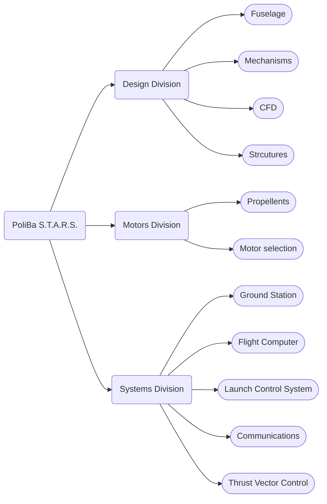

PoliBa S.T.A.R.S. (Student Team for Advanced Rocketry and Space) is a group of students of Politecnico di Bari, who share a passion for rockets and space. It was created with the goal of building a rocket for [EuRoC](https://euroc.pt/) the European Rocketry Challenge. While EuRoC remains the main objective, learning and the fun of building rockets is an important aspect of the group. 

Because of the heterogeneous composition of the team, we are able to work on different parts of the rocket. From the ground to flight operations we try to develop solutions on our own. We write the software of the flight computer and ground station, design the fuselage and other mechanisms used on the rocket, develop the electronics like the flight computer or the Launch Control System.

## The Team
The students who take part into this project are interested to the aerospace sector in general. Due to the different backgrounds of the members, various aspects are mastered such as: software, electronic, chemestry and mechanical engineering. 

For this reason the team is divided into three main groups called divisions. More informations are found on the dedicated page of each division:
###### [Design Division](/design-division)
###### [Motors Division](/motors-division)
###### [Systems Division](/systems-division)

The separation in division is used to gather students with the same interests in order to achive higher levels of expertise in specific fields.

However students from different divisions are encouraged to works together with members specialized in other subjects. For this reason we have to types of projects: division projects and joint projects.

The design and construction of the rocket is considered a joint project, but some of its subsystems are assigned to a single division.

